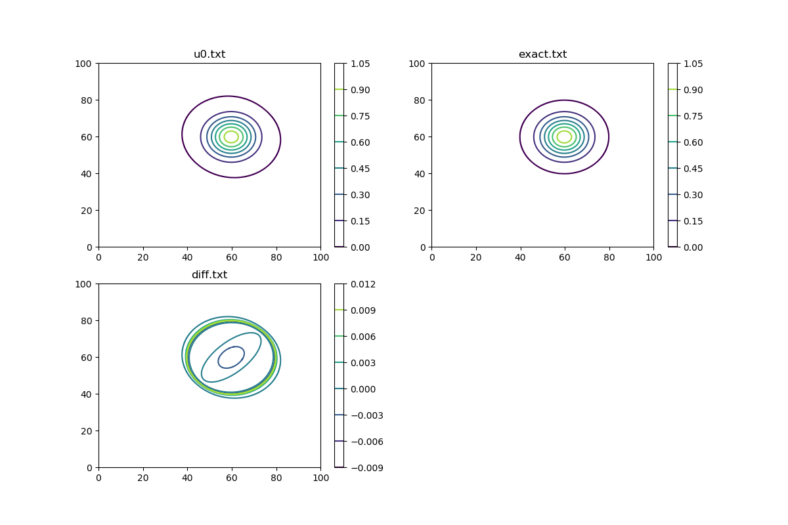

当前阶段：直接从MATLAB代码转化为c

### 编译:

```
gcc -Wall -g -o FDTD2Dsolver FDTD2Dsolver.c -lm
```

### 运行:

```
./FDTD2Dsolver
python plot.py
```

### 结果：

生成3个数据文件`u0.txt`, `exact.txt`, `diff.txt`

python脚本利用上述数据生成图像


vx=vy=0.5,NX=NY=2048,Ntimesteps=500,结束时间约t=19.5


